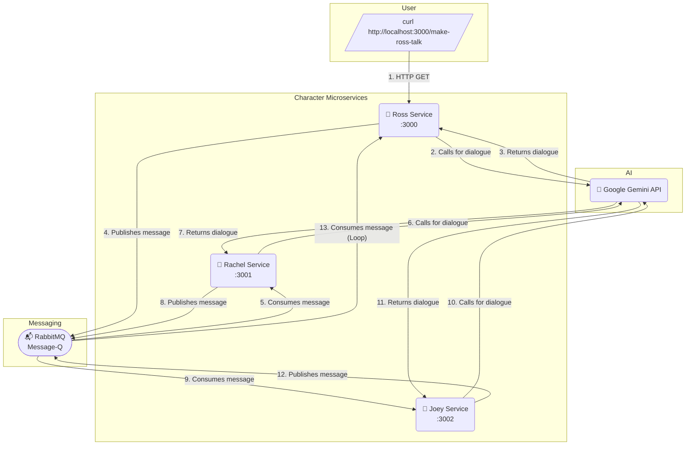

# 🎭 Friends_Distributed_Simulation

> *A distributed backend system where sitcom characters like Ross and Rachel never stop talking — powered by LLMs and RabbitMQ.*

No frontend. Just relentless sarcasm, asynchronous messaging, and AI-fueled banter.  
Because who needs REST when you can have **Ross screaming into a message queue**?


---

## 🧠 What It Is

**Friends_Distributed_Simulation** (a.k.a. *SitcomGPT*) is a distributed backend that simulates real-time conversations between fictional characters from *Friends*, powered by:

- 🤖 **Google Gemini** for character-style dialogue  
- 📬 **RabbitMQ** for asynchronous message passing  
- ⚙️ **Node.js + Express** for lightweight, autonomous character services  


Each character runs as its **own service**, connected through a shared RabbitMQ queue.  
Together, they chat endlessly — creating a self-sustaining sitcom in code form.

---

## 🧩 Architecture Overview



| Component | Purpose |
|------------|----------|
| 🧠 Google Gemini API | Generates witty, character-style one-liners |
| 📬 RabbitMQ | Routes messages between character microservices |
| ⚙️ Node.js + Express | Powers each autonomous sitcom agent |
| 🔁 Queue Loop | Keeps conversations running asynchronously |

Each “character” acts like an independent actor on a stage — listening for cues and responding when it’s their turn.

---

## 🛠️ Setup

### 1️⃣ Clone the Repository
```bash
git clone https://github.com/yourusername/sitcom-gpt.git
cd sitcom-gpt
````

### 2️⃣ Install Dependencies

```bash
npm install
```

### 3️⃣ Create a `.env` File

Add your Google Gemini API key:

```
GEMINI_API_KEY=your-api-key-here
```

### 4️⃣ Run RabbitMQ Locally

If you have RabbitMQ installed:

```bash
rabbitmq-server
```

It should be available at the default URL:
`amqp://localhost`

---

## 🚀 Start the Characters

Each character (e.g., **Ross**, **Rachel**, **Joey**) runs on its own port and listens to the same shared message queue.

```bash
# Terminal 1 - Ross service
node ross.js

# Terminal 2 - Rachel service
node rachel.js

# Terminal 3 - Joey service
node joey.js
```

Once all are running, start the conversation by triggering Ross:

```bash
curl http://localhost:3000/make-ross-talk
```

---

## 💬 Example Interaction

```
📩 Ross ➡️ Rachel: "You were *so* on a break."
💬 Rachel ➡️ Ross: "And you're still on pause, emotionally."
📩 Ross ➡️ Rachel: "I'm not emotionally unavailable, I'm just... historically cautious."
💬 Joey ➡️ Everyone: "Wait, what break? Are we getting snacks?"
```

The conversation loops asynchronously through RabbitMQ until the `turn` limit is reached — or until emotional stability is lost.

---

## 🧱 Tech Stack

| Layer             | Technology          |
| ----------------- | ------------------- |
| Backend Framework | Node.js + Express   |
| Messaging System  | RabbitMQ            |
| AI Engine         | Google Gemini (LLM) |

---

## ⚙️ How It Works

1. Each character is a small **Express app** running on a different port.
2. They all connect to the same **RabbitMQ queue** (`Message-Q`).
3. When one character speaks, the message is sent to the queue.
4. Another character consumes the message, generates a Gemini-powered reply, and sends it back.
5. This continues asynchronously, forming a distributed conversation loop.

💡 Each agent uses prompt engineering to stay in character —
Joey stays clueless, Ross stays defensive, Rachel stays dramatic.

---

## 🧠 Example Joey Prompt

```js
const prompt = `You're Joey from Friends. ${from} just told you: "${message}".
Reply with a short, funny, or clueless one-liner.
No narration, no names — just dialogue.`;
```

Output:

```
📩 Rachel ➡️ Joey: "Do you ever read the news?"
💬 Joey ➡️ Rachel: "Only if it’s about pizza or me."
```

---

## 🧭 Future Ideas

* [ ] Add more characters (Chandler, Monica, Phoebe)
* [ ] Add memory or context history per character
* [ ] Visualize message flow between agents
* [ ] Introduce sentiment analysis or “mood swings”
* [ ] Auto-scale characters when drama peaks

---

## ☕ Why This Exists

Because:

* I love distributed systems
* I love AI models
* And I *really* love the idea of **Ross and Rachel arguing forever**

It’s part social experiment, part backend simulation, part emotional chaos.

---

## 📬 Contact

**Author:** [Rayaan Pasha](https://github.com/mdrayaanpasha)
*Full-stack developer • AI tinkerer • Distributed chaos enjoyer.*

---

> “Could this system **BE** any more asynchronous?”


