# 🎭 Friends_Distributed_Simulation

> *A stateful, distributed backend where sitcom characters argue via RabbitMQ — now with a database for long-term grudges.*

No frontend. Just persistent sarcasm, asynchronous routing, and AI-fueled banter.  
**Ross doesn't just scream into a queue; he now remembers what you said 5 minutes ago.**

---

## 🧠 Evolution: What's New?

This version moves beyond simple loops into a **stateful microservice mesh**. Characters no longer "forget" the conversation history; they use a database to maintain context and can even "side-talk" to other characters behind your back.

* 🗄️ **Prisma & DB**: Stores conversation logs for short-term memory.
* 🔀 **RabbitMQ Direct Exchange**: Specific routing keys allow targeted 1-on-1 messaging.
* 🧠 **Contextual AI**: Characters inject the last 5 messages into their prompt for better continuity.
* 🎲 **Gossip Logic**: A 10% chance for a character to start a side-thread with another roommate.

---

## 🧩 Architecture

```mermaid
graph TD
    subgraph User
        Trigger[/"GET /start-convo-bro"/]
    end

    subgraph "Character Service (e.g., Ross)"
        App[Express App]
        DB[(Prisma / DB)]
        Logic{AI Logic}
    end

    subgraph Messaging
        Exchange[[📬 friends-exchange <br> Direct]]
        Q_Ross([Queue: q-Ross])
        Q_Rachel([Queue: q-Rachel])
    end

    Trigger --> App
    App -- "1. Logs to DB" --> DB
    App -- "2. Routes to Rachel/Joey" --> Exchange
    Exchange -- "Routing Key" --> Q_Rachel
    Q_Rachel -- "3. Consumes" --> RachelService

```




---

## 🛠️ Setup

### 1️⃣ Database Migration

This project uses **Prisma**. Ensure your schema includes a `Logs` model, then run:

```bash
npx prisma db push

```

### 2️⃣ Environment Variables

Update your `.env` to include your Database URL and RabbitMQ endpoint:

```env
GEMINI_API_KEY=your_key
RABITMQ_URL=amqp://localhost
DATABASE_URL="postgresql://..."

```

### 3️⃣ Run the Cluster

The services are designed to run concurrently using the `dev` script:

```bash
npm run dev

```

---

## ⚙️ How It Works

1. **Direct Routing**: Each character (Ross, Rachel, Joey) listens on a private queue (`q-CharacterName`) bound to the `friends-exchange`.
2. **Stateful Memory**: When a message arrives, the character:
* Saves the message to the DB via Prisma.
* Retrieves the **last 5 messages** of that specific `conversationId` to build context.
* Feeds that history into **Google Gemini** to generate a relevant, snarky reply.


3. **The "Gossip" Factor**: There is a 10% chance a character will randomly message someone else in the group to "talk about" the current conversation, creating branching dialogues.
4. **Circuit Breaker**: To save your API credits, conversations have a **hard stop** after 10 exchanges.

---

## 💬 Example Interaction

**System:** Ross starts a conversation with Rachel.
**Ross (via AI):** "Hey! How you doin'?"
**Rachel (via DB Memory):** "Ross, you've been sitting there for an hour. Use your own catchphrase."
**Ross (Side-talking to Joey):** "I was just talking to Rachel. Thought I'd say hi. She's being... herself."

---

## 🧱 Tech Stack

| Layer | Technology |
| --- | --- |
| **Backend Framework** | Node.js (ES Modules) + Express |
| **ORM** | Prisma |
| **Messaging System** | RabbitMQ (Direct Exchange) |
| **AI Engine** | Google Gemini (via characterAI.js) |

---

## 🧭 Future Ideas

* [ ] **Sentiment Scoring**: If the AI detects "anger," increase the probability of side-talking.
* [ ] **Chandler's Sarcasm Engine**: A dedicated middleware for Chandler to intercept and comment on all messages.
* [ ] **The "Coffee House" Visualizer**: A simple dashboard to see the message flow in real-time.

---

> “Could this system **BE** any more asynchronous?”

```

Would you like me to help you define the **Prisma Schema** to ensure the `Logs` table matches this logic perfectly?

